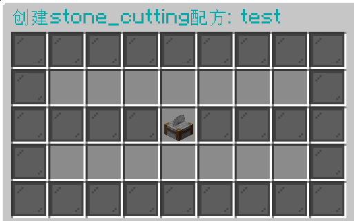

# 通过GUI创建配方


注意：GUI创建配方处于早期阶段，只支持简单的配方创建功能。如果需要更完善的插件体验，请您学着通过编写配置文件来新建配方。


## 有序配方

<figure><figcaption></figcaption></figure>

左侧9个空位为摆放合成物品的区域，右侧绿色玻璃板包围的空位放置合成结果。放置完毕后，点击中间的工作台即可完成创建。

## 无序配方

<figure><figcaption></figcaption></figure>

左侧9个空位为摆放合成物品的区域，右侧绿色玻璃板包围的空位放置合成结果。放置完毕后，点击中间的工作台即可完成创建。

## 烧炼配方

<figure><figcaption></figcaption></figure>

左侧蓝色玻璃板包围的空位放置烧炼物品，右侧绿色玻璃板包围的空位放置合成结果。下方熔炉、高炉、烟熏炉、营火是新增该类型的配方的按钮，点击开启或关闭。放置并选择完毕后，点击中间的熔炉即可完成创建。

## 锻造配方

<figure><figcaption></figcaption></figure>

右侧第一个空位放置第一个物品，第二个空位空位放置第二个物品，右侧绿色玻璃板包围的空位放置合成结果。放置完毕后点击中间的锻造台即可完成创建。

当版本高于1.20时，左侧第一个空位放置模板物品，第二个空位放置第一个物品，第三个空位放置第二个物品。

## 切石配方

<figure><figcaption></figcaption></figure>

通过GUI创建切石机配方会创建一个多对多的配方，即上面每一个物品都可以切成下面任意一个物品。上方一行空位放置切制物品，下方一行空位放置切制结果。放置完毕后点击中间的切石机即可完成创建。

## 酿造配方

<figure><figcaption></figcaption></figure>

左侧放输入物品，即酿造台下面三个槽位的物品，中间放原料，即酿造台最上面的物品，右侧放结果，即酿造完毕产出的物品。放置完毕后，点击最下方的酿造台即可完成创建。
